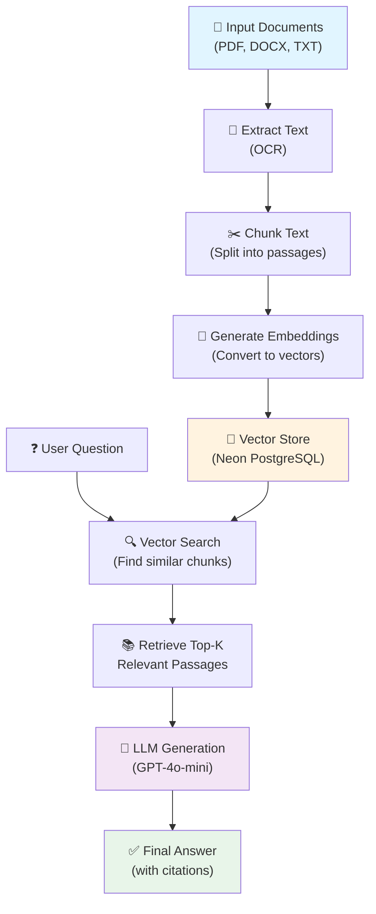

# Charter Party RAG - System Architecture

## Project Flow Diagram

## Simplified Flow

**3 Main Steps:**

1. **INGEST** → Documents → Extract → Chunk → Embed → Store in Database
2. **RETRIEVE** → Question → Search vectors → Get top passages
3. **ANSWER** → Context + Question → LLM → Final Answer

## Component Overview

| Component | Purpose | Technology |
|-----------|---------|------------|
| **Input** | Charter party documents | PDF, DOCX, TXT |
| **Text Extraction** | OCR & parsing | Google Cloud API |
| **Chunking** | Break into passages | LangChain |
| **Embedding** | Convert to vectors | OpenAI API |
| **Vector Store** | Semantic search database | Neon + pgvector |
| **Retrieval** | Find relevant chunks | Vector similarity |
| **LLM** | Generate answers | GPT-4o-mini |

---

**Key Benefit:** RAG allows the LLM to answer questions using your specific charter party documents, ensuring accurate, cited responses.
